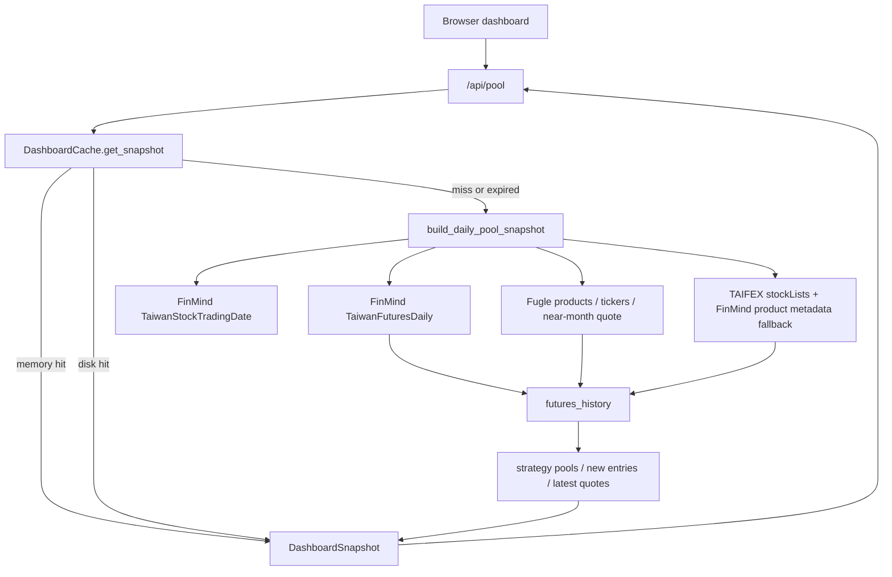

# Dashboard 更新與快取流程紀錄

紀錄日期：2026-06-16

這份文件紀錄目前 Web dashboard 的資料更新流程、快取行為，以及閱讀程式時確認到的開發重點。主要對應檔案是 `src/web_dashboard.py`、`src/data_sources.py`、`src/stock_pool.py`。

## 目前資料主線

Web dashboard 的主線不是直接用股票現貨成交量，而是以股票期貨商品資料建立股期池：

1. 前端載入 dashboard shell 後呼叫 `/api/pool`。
2. `/api/pool` 解析 query string：
   - `min_atr_percent`：ATR% 門檻。
   - `as_of`：指定資料日期。
   - `refresh=1`：要求略過既有快取重建。
3. `DashboardCache.get_snapshot()` 決定使用記憶體快取、磁碟快取，或重新打外部 API。
4. 若需要重建，`build_daily_pool_snapshot()` 會抓取 FinMind、Fugle、TAIFEX 資料並組成 `DashboardSnapshot`。
5. 回傳 JSON 給前端，前端重畫股池、新進榜、watchlist 與今日速覽。



## Snapshot 建立邏輯

`build_daily_pool_snapshot()` 的重建流程：

1. 讀取 `.env`，需要 FinMind token；Fugle token 可選，但盤中 quote 需要它。
2. 將要求日期標準化：
   - 未指定 `as_of` 時使用台北時間今天。
   - 未來日期會被壓回今天。
   - `end_day < today` 視為歷史模式。
3. 判斷是否使用 Fugle quote layer：
   - 台北交易時段使用 Fugle 盤中 near-month quote。
   - 盤後若 `USE_FUGLE_POST_CLOSE_QUOTE` 未關閉，也會嘗試用 Fugle 收盤 quote。
4. 商品對照優先從 Fugle products 建立；若不可用，改用 TAIFEX 契約清單加 FinMind `TaiwanFutOptDailyInfo`。
5. 從 FinMind 取最近交易日，再逐日取 `TaiwanFuturesDaily`，直到湊足 `max(volume_days, atr_days + 1)`。
6. 將 FinMind 日資料正規化為 `futures_history`。
7. 若有 Fugle quote，轉成同格式後覆蓋/合併同日期同商品資料。
8. 依 `futures_history` 產出：
   - 小型高價股期股池：`contract_type == "small"`，價格 500 到 5000。
   - 大型活躍股期池：`contract_type == "regular"`，價格 0 到 200。
   - 新進榜：最新一日進入成交口數 Top N、前一交易日未在 Top N。
   - Watchlist：最新日每個標的的股期報價與成交口數。
9. 將結果包成 `DashboardSnapshot`，並在 `source` 寫入資料來源、Fugle 狀態、final readiness 與 cache schema。

## 篩選規則

dashboard 目前使用 `build_futures_strategy_pool()` 做策略池：

1. 對最近 `volume_days`，同一標的下所有股票期貨商品與月份加總成交口數。
2. 每個交易日各自排名，保留每天都在 Top N 的標的。
3. 依商品類型分成小型或大型，再用股期 OHLC 計算 ATR。
4. 套用價格區間與 `min_atr_percent`。
5. 排序優先順序：
   - `atr_20_percent` 由高到低。
   - `avg_volume_5d` 由高到低。
   - `worst_volume_rank_5d` 由低到高。

`src/stock_pool.py` 仍保留較通用的股池函式與 CLI 使用路徑；Web dashboard 主線目前主要在 `src/web_dashboard.py` 內處理股期商品歷史與快照。

## 快取種類

目前有兩種 cache kind：

- `intraday`：今天交易時段的即時快照。
- `final`：歷史日期或盤後正式快照。

選擇邏輯：

1. `as_of` 是歷史日期時，直接使用 `final`。
2. 今天且仍在台北交易時段時，使用 `intraday`。
3. 今天非交易時段時，優先找 `final`；盤中 `intraday` 不會直接當盤後正式資料。
4. 如果找不到可用 `final`，就重建今天的 snapshot；只有 `final_ready` 成立時才寫入正式 `final` 快取。

## 快取命中順序

`DashboardCache` 的查找順序：

1. 記憶體：
   - `self.snapshots`
   - `self.loaded_at`
2. 磁碟：
   - 預設在 `data/cache/`
   - 先讀新版檔名，再讀 legacy 檔名。
3. 重建：
   - 呼叫 `build_daily_pool_snapshot()`。
   - 寫回記憶體與磁碟。

磁碟寫入使用暫存檔加 `os.replace()`：

```text
dashboard_asof{date}_{cache_kind}_vol{volume_days}_top{volume_top_n}_atr{atr_days}_price{min_price}-{max_price}_minatr{min_atr}.json
```

例：

```text
data/cache/dashboard_asof2026-06-16_final_vol5_top50_atr20_price500-5000_minatr3.json
```

legacy 檔名沒有 `{cache_kind}`，例如：

```text
data/cache/dashboard_asof2026-06-16_vol5_top50_atr20_price500-5000_minatr3.json
```

讀到舊 snapshot 時會透過 `migrate_cached_snapshot()` 補上 schema v3 需要的欄位，例如 `spread`、`snapshot_stage`、`final_ready`、`final_readiness_reason`、`cache_schema_version`。

## TTL 與刷新規則

TTL 由環境變數控制：

- 歷史日期：`DASHBOARD_HISTORICAL_CACHE_SECONDS`，預設 30 天。
- 今天交易時段：`DASHBOARD_CACHE_SECONDS`，預設 30 秒。
- 今天非交易時段：`DASHBOARD_CACHE_SECONDS`，預設 900 秒。
- 若 `DASHBOARD_CACHE_SECONDS=0`，live `/api/pool` 每次請求都會重建，不使用 dashboard snapshot cache；重建失敗時仍會依 fallback 流程嘗試 stale snapshot。

特殊規則：

1. 今天非交易時段可重用已存在的快照，即使超過 TTL。
2. 盤後有三個 closing checkpoint：13:30、13:45、14:00。
3. 如果快照建立時間早於目前已到達的 checkpoint，會被視為不新鮮，需要重建。
4. 重建完成後，同一 checkpoint 後續請求會共用同一份快照。
5. `refresh=1` 會略過既有 cache，強制走重建流程。

## 併發控制

每個 cache key 都有一把 refresh lock：

```text
(as_of_date, volume_days, volume_top_n, atr_days, min_price, max_price, min_atr_percent, cache_kind)
```

同一組條件同時進來時，只有第一個 request 會重建；其他 request 會等 lock，之後再讀已更新的快照。這避免多人同時開 dashboard 時對外部 API 打出重複請求。

## Final Readiness

`final_ready` 會影響今天盤後資料是否能被寫入 `final` cache。

目前判斷：

- 交易時段：`final_ready = False`，`snapshot_stage = "intraday"`。
- 歷史日期：視為 final。
- 今天盤後且 Fugle post-close quote 可用：視為 final。
- 今天盤後且使用 FinMind 日資料：用 `final_readiness_from_daily_history()` 比對今日商品數與近幾日商品數。

注意：`final_readiness_from_daily_history()` 目前即使今日商品數低於門檻，也會回傳 `final_ready = True`，但會在 metrics 標記 `daily_final_low_coverage = True`，reason 文字會顯示「已取得」而非「完整」。這代表低覆蓋率資料仍可能被寫入 `final` cache，後續如果要更嚴格，需要調整這段行為。

## 前端自動更新

前端腳本會：

1. 頁面載入後呼叫 `loadPool()`。
2. 每 30 秒檢查交易時段或盤後 checkpoint。
3. 交易時段或到達 checkpoint 時背景呼叫 `/api/pool`。
4. 成功後只更新表格與圖表內容，並保留目前 scroll 位置。

因此實際 API 壓力主要由後端 shared cache 控制，而不是每個瀏覽器都直接重打外部 API。

## 已觀察到的實際快取狀態

目前 `data/cache/` 內同時存在：

- schema v3 的 `final` 檔，例如 2026-06-16 15:01 建立的正式快照。
- legacy 無 cache kind 的舊檔，例如盤中建立的 schema v2 快照。

這和程式中的 legacy reader / migration 設計一致。

## 待同步或後續確認

1. README 仍提到 dashboard 會回頭從 FinMind 取得股票價格與 ATR，且只抓可能入池股票價格；但目前主線看起來已改成用 `TaiwanFuturesDaily` 的股期 OHLC 與成交口數計算。
2. `fetch_recent_finmind_price_history_for_stock_ids()` 與 `candidate_stock_ids_from_futures_volume()` 目前不像主流程必要路徑，可能是舊設計或後續優化預留。
3. 若希望低覆蓋率 FinMind 日資料不要寫成正式 final cache，需要修改 `final_readiness_from_daily_history()` 的回傳條件。
